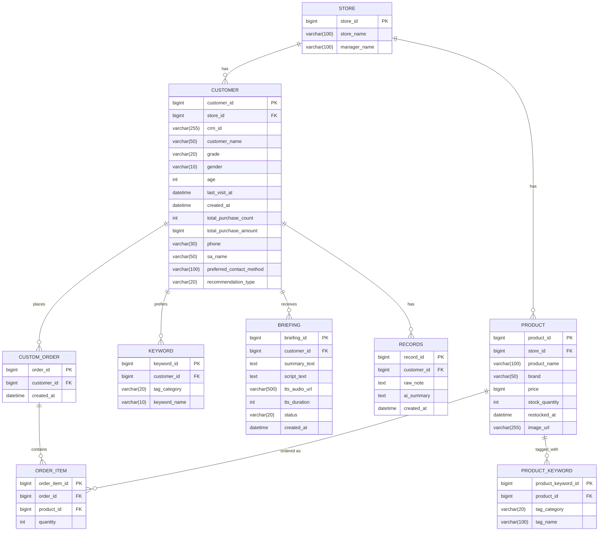

# ERD

## 다이어그램



## DDL (수정본)

```sql
CREATE TABLE `product` (
        `product_id`    BIGINT    NOT NULL AUTO_INCREMENT PRIMARY KEY,
        `store_id`    BIGINT    NOT NULL    COMMENT '매장ID',
        `product_name`    VARCHAR(100)    NULL,
        `brand`    VARCHAR(50)    NULL,
        `price`    BIGINT    NULL,
        `stock_quantity`    INT    NULL,
        `restocked_at`    DATETIME    NULL    COMMENT '재입고 추천 로직 판단용',
        `image_url`    VARCHAR(255)    NULL
);

CREATE TABLE `custom_order` (
        `order_id`    BIGINT    NOT NULL AUTO_INCREMENT PRIMARY KEY,
        `customer_id`    BIGINT    NOT NULL,
        `created_at`    DATETIME    NULL
);

CREATE TABLE `keyword` (
        `keyword_id`    BIGINT    NOT NULL AUTO_INCREMENT PRIMARY KEY,
        `customer_id`    BIGINT    NOT NULL,
        `tag_category`   VARCHAR(20)   NULL    COMMENT 'Java TagCategory Enum (BRAND, COLOR, MATERIAL, MOOD)',
        `keyword_name`    VARCHAR(10)    NULL
);

CREATE TABLE `store` (
        `store_id`    BIGINT    NOT NULL AUTO_INCREMENT PRIMARY KEY    COMMENT '매장ID',
        `store_name`    VARCHAR(100)    NOT NULL    COMMENT '매장명',
        `manager_name`    VARCHAR(100)    NULL
);

CREATE TABLE `customer` (
        `customer_id`    BIGINT    NOT NULL AUTO_INCREMENT PRIMARY KEY,
        `store_id`    BIGINT    NOT NULL,
        `crm_id`    VARCHAR(255)    NULL,
        `customer_name`    VARCHAR(50)    NOT NULL,
        `grade`    VARCHAR(20)    NULL,
        `gender`    VARCHAR(10)    NULL,
        `age`    INT    NULL,
        `last_visit_at`    DATETIME    NULL,
        `created_at`    DATETIME    NOT NULL    DEFAULT CURRENT_TIMESTAMP,
        `total_purchase_count`    INT    NULL,
        `total_purchase_amount`    BIGINT    NULL,
        `phone`    VARCHAR(30)    NULL,
        `sa_name`    VARCHAR(50)    NULL,
        `preferred_contact_method`    VARCHAR(100)    NULL,
        `recommendation_type`    VARCHAR(20)    NULL    COMMENT 'Java RecommendationType Enum (RESTOCK, HIGH_MATCH)'
);

CREATE TABLE `order_item` (
        `order_item_id`    BIGINT    NOT NULL AUTO_INCREMENT PRIMARY KEY,
        `order_id`    BIGINT    NOT NULL,
        `product_id`    BIGINT    NOT NULL,
        `quantity`    INT    NULL
);

CREATE TABLE `product_keyword` (
        `product_keyword_id`    BIGINT    NOT NULL AUTO_INCREMENT PRIMARY KEY,
        `product_id`    BIGINT    NOT NULL,
        `tag_category`    VARCHAR(20)    NULL    COMMENT 'Java TagCategory Enum (BRAND, COLOR, MATERIAL, MOOD)',
        `tag_name`    VARCHAR(100)    NULL    COMMENT 'ex) 블랙, 미니멀, 스무드 레더'
);

CREATE TABLE `briefing` (
        `briefing_id`    BIGINT    NOT NULL AUTO_INCREMENT PRIMARY KEY,
        `customer_id`    BIGINT    NOT NULL,
        `summary_text`    TEXT    NULL,
        `script_text`    TEXT    NULL,
        `tts_audio_url`    VARCHAR(500)    NULL    COMMENT '음성 브리핑 파일(BRIEF-03)',
        `tts_duration`    INT    NULL    COMMENT '재생 길이(초)',
        `status`    VARCHAR(20)    NOT NULL    DEFAULT 'SUCCESS'    COMMENT '상태(SUCCESS/NO_HISTORY/API_FAIL)',
        `created_at`    DATETIME    NOT NULL    DEFAULT CURRENT_TIMESTAMP
);

CREATE TABLE `records` (
        `record_id`    BIGINT    NOT NULL AUTO_INCREMENT PRIMARY KEY,
        `customer_id`    BIGINT    NOT NULL,
        `raw_note`    TEXT    NOT NULL,
        `ai_summary`    TEXT    NOT NULL,
        `created_at`    DATETIME    NOT NULL    DEFAULT CURRENT_TIMESTAMP
);
```

## 구현 시 반영/변경 사항

- Java 엔티티의 Enum 타입(`TagCategory`, `RecommendationType`)과의 안정적인 JPA 매핑(`EnumType.STRING`)을 위하여 DDL 및 Mermaid 다이어그램 내 해당 데이터 타입을 `VARCHAR(20)`으로 통일함.
- JPA `GenerationType.IDENTITY` 생성을 정상 지원하도록 DDL 내 전 테이블 PK에 `AUTO_INCREMENT PRIMARY KEY`를 선언함.
- Mermaid 다이어그램 블록 상단의 중복 키워드 문법 오류를 수정함.
- `keyword` 테이블 PK 선언, FK 제약조건의 Hibernate 자동 생성(`@ManyToOne` + `@JoinColumn`), 패키지 구조 배치는 기존 변경 사항과 동일하게 유지함.