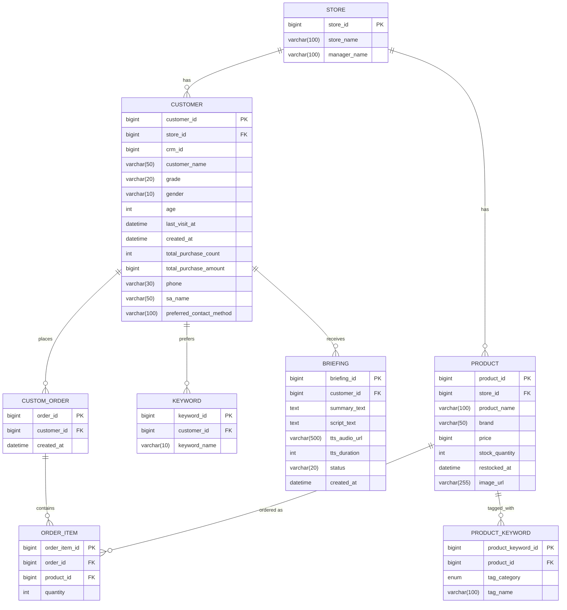

# ERD

## 다이어그램



## DDL (원본)

```sql
CREATE TABLE `product` (
    `product_id`    BIGINT    NOT NULL,
    `store_id`    BIGINT    NOT NULL    COMMENT '매장ID',
    `product_name`    VARCHAR(100)    NULL,
    `brand`    VARCHAR(50)    NULL,
    `price`    BIGINT    NULL,
    `stock_quantity`    INT    NULL,
    `restocked_at`    DATETIME    NULL    COMMENT '재입고 추천 로직 판단용',
    `image_url`    VARCHAR(255)    NULL
);

CREATE TABLE `custom_order` (
    `order_id`    BIGINT    NOT NULL,
    `customer_id`    BIGINT    NOT NULL,
    `created_at`    DATETIME    NULL
);

CREATE TABLE `keyword` (
    `customer_id`    BIGINT    NOT NULL,
    `keyword_name`    VARCHAR(10)    NULL
);

CREATE TABLE `store` (
    `store_id`    BIGINT    NOT NULL    COMMENT '매장ID',
    `store_name`    VARCHAR(100)    NOT NULL    COMMENT '매장명',
    `manager_name`    VARCHAR(100)    NULL
);

CREATE TABLE `customer` (
    `customer_id`    BIGINT    NOT NULL,
    `store_id`    BIGINT    NOT NULL,
    `crm_id`    BIGINT    NULL,
    `customer_name`    VARCHAR(50)    NOT NULL,
    `grade`    VARCHAR(20)    NULL,
    `gender`    VARCHAR(10)    NULL,
    `age`    INT    NULL,
    `last_visit_at`    DATETIME    NULL,
    `created_at`    DATETIME    NOT NULL    DEFAULT CURRENT_TIMESTAMP,
    `total_purchase_count`    INT    NULL,
    `total_purchase_amount`    BIGINT    NULL,
    `phone`    VARCHAR(30)    NULL,
    `sa_name`    VARCHAR(50)    NULL,
    `preferred_contact_method`    VARCHAR(100)    NULL
);

CREATE TABLE `order_item` (
    `order_item_id`    BIGINT    NOT NULL,
    `order_id`    BIGINT    NOT NULL,
    `product_id`    BIGINT    NOT NULL,
    `quantity`    INT    NULL
);

CREATE TABLE `product_keyword` (
    `product_keyword_id`    BIGINT    NOT NULL,
    `product_id`    BIGINT    NOT NULL,
    `tag_category`    ENUM    NULL    COMMENT '(BRAND, COLOR, MATERIAL, MOOD)',
    `tag_name`    VARCHAR(100)    NULL    COMMENT 'ex) 블랙, 미니멀, 스무드 레더'
);

CREATE TABLE `briefing` (
    `briefing_id`    BIGINT    NOT NULL,
    `customer_id`    BIGINT    NOT NULL,
    `summary_text`    TEXT    NULL,
    `script_text`    TEXT    NULL,
    `tts_audio_url`    VARCHAR(500)    NULL    COMMENT '음성 브리핑 파일(BRIEF-03)',
    `tts_duration`    INT    NULL    COMMENT '재생 길이(초)',
    `status`    VARCHAR(20)    NOT NULL    DEFAULT 'SUCCESS'    COMMENT '상태(SUCCESS/NO_HISTORY/API_FAIL)',
    `created_at`    DATETIME    NOT NULL    DEFAULT CURRENT_TIMESTAMP
);
```

## 구현 시 반영/변경 사항

- `keyword` 테이블은 원본 DDL에 PK가 정의되어 있지 않아, JPA 엔티티 매핑을 위해 `keyword_id BIGINT AUTO_INCREMENT PK`를 새로 추가함.
- FK 제약조건은 원본 DDL에 명시되어 있지 않았지만, 기존 `store`/`customer`/`briefing` 컨벤션과 동일하게 `@ManyToOne` + `@JoinColumn`으로 매핑하여 Hibernate가 FK 제약조건을 자동 생성하도록 함 (`product.store_id`, `custom_order.customer_id`, `keyword.customer_id`, `order_item.order_id`/`product_id`, `product_keyword.product_id`).
- `custom_order.created_at`은 DDL상 `NULL` 허용이라 `BaseTimeEntity`(NOT NULL 강제)를 상속하지 않고 별도 `@CreatedDate` 필드로 매핑함.
- 패키지 구조: `domain/product`(Product, ProductKeyword, TagCategory), `domain/order`(CustomOrder, OrderItem), `domain/customer`(기존 Customer 확장 + Keyword 신규 추가).
- 이번 작업은 엔티티/리포지토리 스키마 반영까지이며, Service/Controller/DTO(브리핑 상세 API 등)는 다음 단계에서 별도로 진행.
