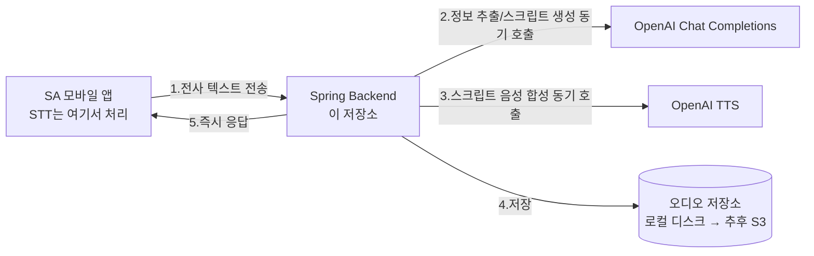
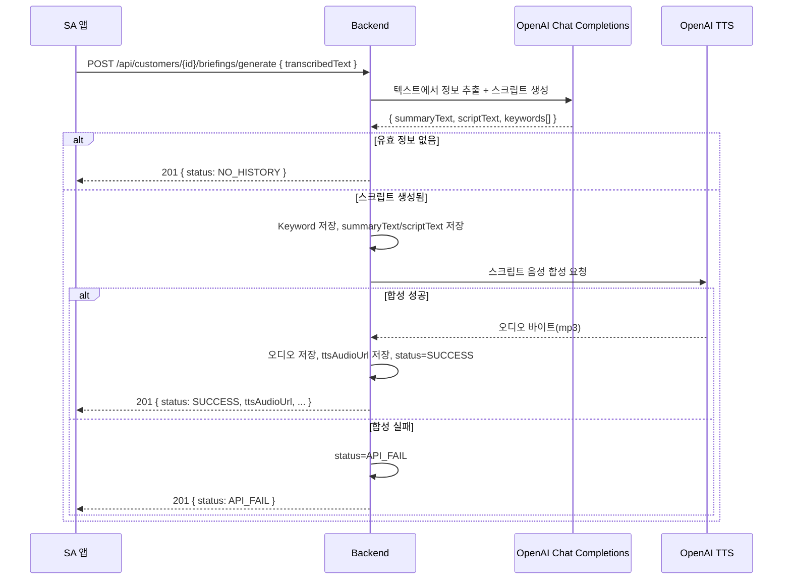

# AI 브리핑 생성 + TTS 연동 설계

## 개요

STT(음성→텍스트 전사)는 프론트엔드(SA 앱)에서 처리해 이미 전사된 텍스트를 Backend로 전달하므로, 이 저장소는 STT를 다루지 않는다.

Backend가 담당하는 흐름은 다음 한 가지다.

- **브리핑 생성 흐름**: SA 앱이 전사된 텍스트를 보내면 → 텍스트에서 유효한 정보(선호 키워드 등)를 추출하고 AI 브리핑 스크립트(`scriptText`)를 생성 → OpenAI TTS로 스크립트를 음성으로 합성 → 오디오 파일 저장 → 결과를 즉시 응답.

AI 정보 추출/스크립트 생성과 TTS 합성 모두 OpenAI API를 **동기 호출**한다. 별도의 Python 마이크로서비스나 콜백 구조는 두지 않는다 — 두 호출 모두 초 단위로 응답하는 외부 HTTP API 호출이라 요청 하나 안에서 순차 처리하면 충분하기 때문이다. 음성 파일은 로컬 파일시스템에 저장하고, 저장소 접근은 인터페이스(`AudioStorageService`)로 추상화해서 나중에 S3 등으로 교체 가능하게 한다.

## 컴포넌트 구성



## 상태 모델

`BriefingStatus`는 세 가지만 사용한다.

```java
public enum BriefingStatus {
    SUCCESS,      // 전체 파이프라인 완료
    NO_HISTORY,   // 추출할 유효 정보 없음
    API_FAIL      // AI/TTS 호출 실패
}
```

콜백이나 폴링이 필요 없다 — 요청 하나가 끝나면 최종 상태가 확정된다. 기존에 이미 구현된 `GET /api/briefings/{briefingId}`로 이후에도 언제든 조회할 수 있다.

## 처리 흐름 (시퀀스)



## API 설계

### SA 앱 → Backend: 브리핑 생성 요청

```
POST /api/customers/{customerId}/briefings/generate
Content-Type: application/json
{
  "transcribedText": "지난번 문의하신 블랙 로퍼가..."
}

201 Created
{
  "isSuccess": true,
  "code": "COMMON201_1",
  "result": {
    "briefingId": 1,
    "customerId": 1,
    "summaryText": "...",
    "scriptText": "...",
    "firstSentence": "...",
    "ttsAudioUrl": "/files/tts/xxxx.mp3",
    "ttsDuration": null,
    "status": "SUCCESS",
    "createdAt": "2026-08-18"
  }
}
```

- `ttsDuration`은 OpenAI TTS 응답에 재생 길이 정보가 포함되지 않아 항상 `null`이다. 재생 길이가 꼭 필요하면 오디오 파일을 디코딩해서 별도로 계산해야 하는데, 현재는 범위 밖으로 둔다.

### Backend → OpenAI TTS (외부 호출 계약)

```
POST https://api.openai.com/v1/audio/speech
Authorization: Bearer {OPENAI_API_KEY}
{
  "model": "tts-1",
  "voice": "alloy",
  "input": "지난번 문의하신 블랙 로퍼가 오늘 입고됐습니다...",
  "response_format": "mp3"
}
→ 200, 오디오 바이트(mp3)
```

`openai.tts.model`, `openai.tts.voice`로 모델/음성을 설정할 수 있다 (`application.yml`).

## 파일 저장 전략

```java
public interface AudioStorageService {
    StoredAudio store(String directory, String fileName, InputStream audio, String contentType);
}
```

- `application.yml`의 `app.storage.audio-base-path`로 로컬 저장 경로를 분리, 서비스가 이 인터페이스만 의존하도록 해서 나중에 `S3AudioStorageService`로 교체 가능하게 함.

## 에러 처리

- AI 생성 호출이 실패하면 `AiBriefingGenerationClient` 구현체 내부에서 처리하고, 실패 시에도 예외를 던지지 않는 정책이면 그 정책을 따른다.
- TTS 호출이 실패(타임아웃, 5xx, API 키 미설정 등)하면 `status=API_FAIL`로 전환한다. summaryText/scriptText는 이미 생성된 값을 유지한다.
- 전사 텍스트에서 유효한 정보를 추출하지 못하면(예: 잡음/무의미 대화) `status=NO_HISTORY`.
