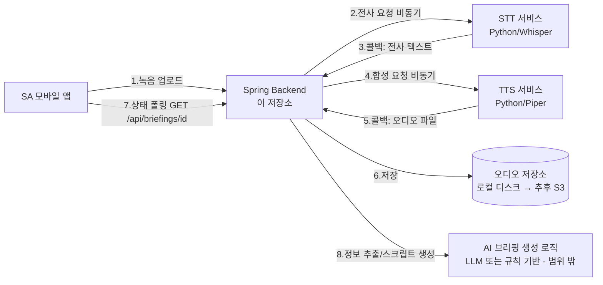
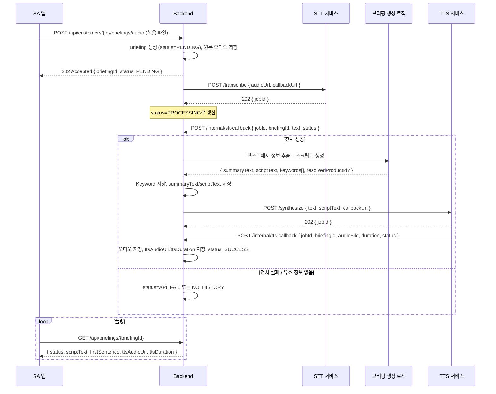

# STT/TTS 마이크로서비스 연동 설계

## 개요

두 개의 별도 흐름이 있다.

1. **입력(STT) 흐름**: SA가 고객과의 대화를 녹음해서 올리면 → 음성을 텍스트로 전사(STT) → 텍스트에서 유효한 정보(선호 키워드, 문의 상품 등)를 추출 → 저장.
2. **출력(TTS) 흐름**: 위에서 추출한 정보를 바탕으로 AI 브리핑 스크립트(`scriptText`)가 만들어지면 → 스크립트를 음성으로 합성(TTS) → 오디오 파일 + 길이 저장 → SA 앱이 "브리핑 듣기"로 재생.

STT/TTS 엔진은 Java 네이티브가 마땅치 않아 **Python 기반 별도 마이크로서비스**로 띄우고, 이 Backend가 REST로 호출하는 구조를 전제로 한다. 처리 시간이 수 초~수십 초 걸릴 수 있어 **비동기(작업 접수 후 콜백)** 방식으로 설계한다. 음성 파일은 지금 단계에서는 **로컬 파일시스템**에 저장하고, 저장소 접근은 인터페이스로 추상화해서 나중에 S3 등으로 교체 가능하게 한다.

## 컴포넌트 구성



## 상태 모델

기존 `BriefingStatus`(`SUCCESS`, `NO_HISTORY`, `API_FAIL`)에 처리 중 상태를 추가한다.

```java
public enum BriefingStatus {
    PENDING,      // 오디오 접수, STT 대기 중
    PROCESSING,   // STT 전사 완료, 정보 추출/스크립트 생성/TTS 합성 진행 중
    SUCCESS,      // 전체 파이프라인 완료 (기존)
    NO_HISTORY,   // 추출할 유효 정보 없음 (기존)
    API_FAIL      // STT/TTS 등 외부 호출 실패 (기존)
}
```

클라이언트는 기존에 이미 구현된 `GET /api/briefings/{briefingId}`를 **폴링**해서 `status`가 `SUCCESS`/`NO_HISTORY`/`API_FAIL`이 될 때까지 기다린다. 새 엔드포인트를 안 만들어도 되는 부분.

## 처리 흐름 (시퀀스)



## API 설계

### 1. SA 앱 → Backend: 브리핑 생성 요청 (신규)

```
POST /api/customers/{customerId}/briefings/audio
Content-Type: multipart/form-data
Body: audio=<파일>

201 Created
{
  "isSuccess": true,
  "code": "COMMON201_1",
  "result": { "briefingId": 1, "status": "PENDING" }
}
```

- 업로드된 원본 오디오는 로컬 저장소에 저장하고, `Briefing`에 `status=PENDING`으로 즉시 레코드를 만들어 `briefingId`를 반환한다.
- **확인 필요**: 원본(입력) 오디오 URL/작업 ID를 `Briefing` 테이블에 같이 저장할지, 아니면 별도 테이블(`briefing_job` 같은)로 분리할지. ERD에 없는 컬럼이라 임의로 추가하지 않고 확인 후 진행하려고 함. 우선 이 설계에서는 `Briefing`에 `input_audio_url`, `stt_job_id` 두 컬럼을 nullable로 추가하는 걸 가정.

### 2. Backend → STT 서비스 (외부 호출 계약)

```
POST {STT_BASE_URL}/transcribe
{
  "audioUrl": "https://.../input/1.wav",
  "callbackUrl": "https://backend/internal/stt-callback",
  "briefingId": 1
}
→ 202 { "jobId": "stt-xxxx" }
```

### 3. STT 서비스 → Backend 콜백 (신규, 내부용)

```
POST /internal/stt-callback
{
  "jobId": "stt-xxxx",
  "briefingId": 1,
  "status": "SUCCESS" | "FAILED",
  "text": "지난번 문의하신 블랙 로퍼가..."
}
```

### 4. Backend → TTS 서비스 (외부 호출 계약)

```
POST {TTS_BASE_URL}/synthesize
{
  "text": "지난번 문의하신 블랙 로퍼가 오늘 입고됐습니다...",
  "callbackUrl": "https://backend/internal/tts-callback",
  "briefingId": 1
}
→ 202 { "jobId": "tts-xxxx" }
```

### 5. TTS 서비스 → Backend 콜백 (신규, 내부용)

```
POST /internal/tts-callback
Content-Type: multipart/form-data
Fields: jobId, briefingId, status, durationSeconds, audio=<파일>
```

- Backend는 받은 오디오 파일을 로컬 저장소에 저장하고 정적 리소스 URL(예: `/files/briefings/{briefingId}.mp3`)로 서빙, `Briefing.ttsAudioUrl`/`ttsDuration`을 갱신, `status=SUCCESS`로 변경.

### 내부(콜백) 엔드포인트 보안

`/internal/**` 경로는 SA 앱에서 직접 호출하면 안 되는 서버-투-서버 전용 엔드포인트다. **확인 필요**: STT/TTS 서비스와 Backend가 같은 사내망/VPC 안에 있는지, 아니면 공인 인터넷을 거치는지에 따라 IP 화이트리스트 또는 공유 시크릿 헤더(`X-Internal-Token`) 인증이 필요함. 지금 설계에는 공유 시크릿 헤더 방식을 기본으로 가정.

## 파일 저장 전략

```java
public interface AudioStorageService {
    String store(String key, InputStream audio, String contentType);
    // 로컬 구현체는 절대경로에 저장 후 정적 서빙 URL을 반환
    // 추후 S3 구현체로 교체 시 인터페이스는 그대로 유지
}
```

- `application.yml`에 `app.storage.audio-base-path` 같은 설정으로 로컬 저장 경로를 분리, 컨트롤러가 아닌 이 인터페이스만 의존하도록 해서 나중에 `S3AudioStorageService`로 교체 가능하게 함.

## 에러 처리

- STT/TTS 호출 자체가 실패(타임아웃, 5xx)하거나 콜백이 일정 시간 내에 안 오면 `status=API_FAIL`로 전환. 재시도 정책(몇 번, 얼마 간격)은 아직 미정 — **확인 필요**.
- 전사 결과 텍스트에서 유효한 정보를 추출하지 못하면(예: 잡음/무의미 대화) `status=NO_HISTORY`.

## 확인 필요 항목 정리

1. `Briefing`에 입력 오디오 관련 컬럼(`input_audio_url`, `stt_job_id`)을 추가할지, 별도 테이블로 분리할지
2. STT/TTS 서비스가 실제로 어디서 호스팅되는지 (같은 네트워크인지 여부 → 콜백 인증 방식 결정)
3. 콜백이 안 오는 경우의 타임아웃/재시도 정책
4. "정보 추출 → 스크립트 생성" 단계(AI 브리핑 생성 로직)를 이 Backend 안에서 구현할지, 별도 서비스로 뺄지 — 이번 설계에서는 범위 밖으로 두고 인터페이스만 열어둠
